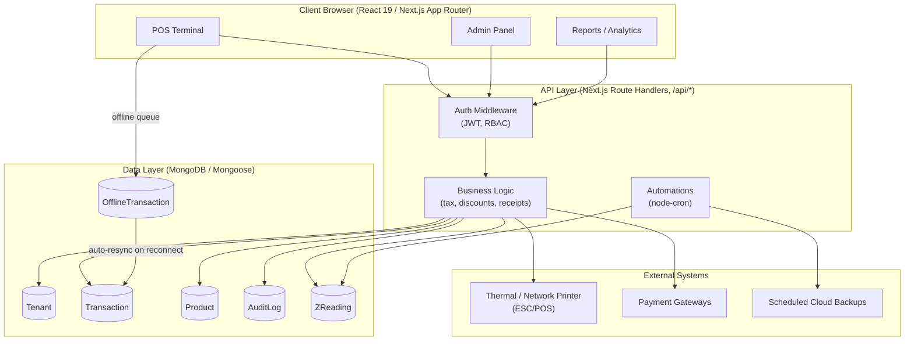
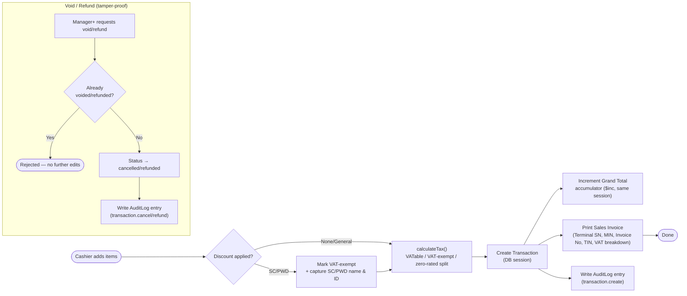
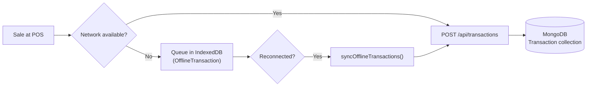
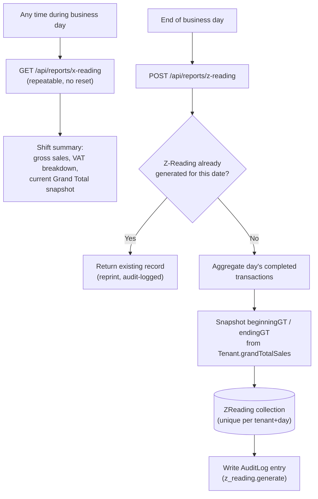
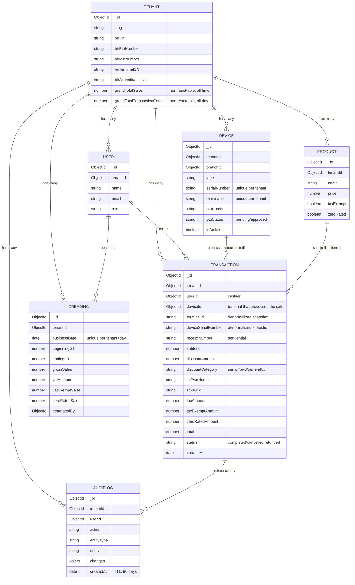

# 1POS - Architecture & Database Schema Diagrams

## BIR Compliance Documentation | Visual System & Process Flowcharts

These Mermaid diagrams accompany [BIR_SYSTEM_OVERVIEW.md](./BIR_SYSTEM_OVERVIEW.md) and [BIR_PROCESS_FLOW.md](./BIR_PROCESS_FLOW.md) as the visual artifacts requested in the BIR accreditation Technical Metadata Package (system/process flowcharts, database schema diagram). They render natively on GitHub and most Markdown/Mermaid-aware viewers.

---

## 1. System Architecture

---

## 2. Sales / Checkout Process Flow (BIR-relevant path)

---

## 3. Offline Resilience Flow (Non-Volatile Memory requirement)

---

## 4. End-of-Day Reading Flow (X-Reading / Z-Reading)

---

## 5. Database Schema (BIR-relevant collections)

> **Retention note**: `AuditLog` currently has a 90-day TTL index (`models/AuditLog.ts`). BIR generally expects longer retention for books of account (commonly cited as 10 years). If the accreditation review requires longer online retention, export periodically via `GET /api/audit-logs/export` (see [BIR_AUDIT_TRAIL.md](./BIR_AUDIT_TRAIL.md)) and archive off-platform, or extend the TTL — this is a policy decision, not something changed silently by this document.

---

*Diagrams generated from the current codebase (`models/`, `app/api/`, `lib/`) as of this document's authoring. Re-verify against source before submission if the schema changes.*
