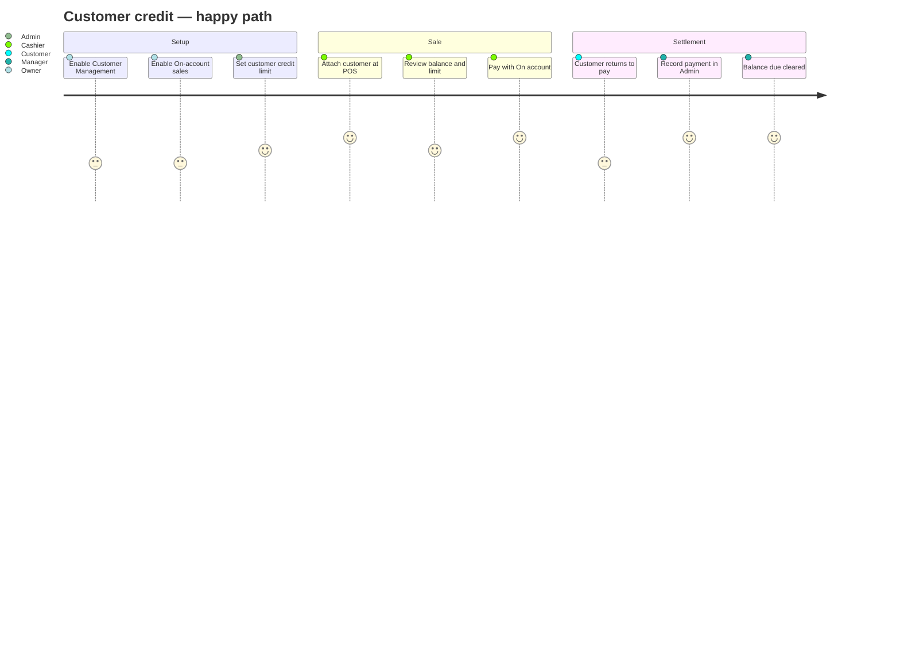
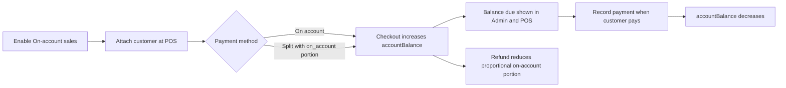

# Customer Credit (On-Account Sales)

**Feature flag:** `enableOnAccountSales`  
**Related setting:** Customer Management (`enableCustomerManagement`)  
**Last updated:** June 2026

---

## Overview

Customer credit lets trusted customers buy now and pay later. When a sale is completed **on account**, the amount is added to the customer’s **balance due** (`accountBalance`). Staff collect payment later through **Record payment** in Admin > Customers.

Optional **credit limits** cap how much a customer can owe. Checkout is blocked if a sale would push their balance above the limit.

| Term | Field / code | Meaning |
|------|----------------|---------|
| **Balance due** | `accountBalance` | Total amount the customer currently owes the store |
| **Credit limit** | `creditLimit` | Maximum allowed balance after a sale; omit or leave empty for no limit |
| **On account** | payment method `on_account` | POS payment type that bills the customer instead of taking cash/card now |
| **Balance payment** | `CustomerBalancePayment` | A recorded settlement (cash, card, etc.) that reduces `accountBalance` |

---

## Prerequisites

Both must be true before on-account workflows appear:

1. **Customer Management** is enabled (Settings) and included in the subscription plan.
2. **On-account sales** is enabled (`enableOnAccountSales` in tenant settings).

See [Settings & Configuration](./user-manual/12-settings.md) and [Feature Flags](./tenant-manual/10-feature-flags.md).

---

## User journeys

Step-by-step paths by role. Each journey lists where the user goes, what they do, and what the system does in response.

### Journey map



---

### 1. Enable on-account credit (Owner / Admin)

**Goal:** Turn on pay-later sales and optionally cap risk per customer.

| Step | Where | Action | System |
|------|-------|--------|--------|
| 1 | **Settings** | Turn on **Customer Management** | POS customer search and Admin > Customers become available (plan permitting) |
| 2 | **Settings** | Turn on **On-account sales** | **On account** appears at POS; **Balance due** and **Record payment** appear in customer admin |
| 3 | **Admin > Customers** | Create or edit a trusted customer | Standard customer fields saved |
| 4 | **Admin > Customers** (edit modal) | Enter **Credit limit** (e.g. `500`) or leave empty for no cap | `creditLimit` stored on the customer record |
| 5 | **POS** (optional check) | Search and attach that customer | Side panel shows **Credit limit** (and **Balance due** if any) |

**Outcome:** Store can charge sales to customer accounts; limits are enforced at checkout.

---

### 2. On-account sale at POS (Cashier)

**Goal:** Complete a sale without immediate payment; bill the customer’s account.

**Preconditions:** On-account enabled; customer exists and is active.

| Step | Where | Action | System |
|------|-------|--------|--------|
| 1 | **POS** — cart | Add items to the sale | Totals calculated as usual |
| 2 | **POS** — Customer panel | Search by name, email, or phone | Matching customers listed |
| 3 | **POS** — Customer panel | Select the customer | Panel shows name, loyalty points (if any), **Balance due**, **Credit limit** |
| 4 | **POS** — Customer panel | Confirm balance and limit are acceptable | Cashier judgment — no hard block until checkout |
| 5 | **POS** — Pay | Open payment; choose **On account** (or split: part on account, part cash/card) | **On account** only shown when a customer is attached |
| 6 | **POS** — Pay | Complete checkout | Transaction + `Payment` (`on_account`) created; `accountBalance` increased by on-account portion |
| 7 | **POS** — receipt | Hand receipt to customer | Sale complete; customer owes more on **balance due** |

**Outcome:** Customer leaves with goods; store ledger shows higher **balance due** for that customer.

**Split payment example:** $100 total → $40 **On account** + $60 **Cash**. Only $40 is added to `accountBalance`; $60 is a normal cash payment.

---

### 3. Collect balance payment (Manager / Admin / Cashier)

**Goal:** Record money received against outstanding balance.

**Preconditions:** Customer has `accountBalance` > 0; on-account enabled.

| Step | Where | Action | System |
|------|-------|--------|--------|
| 1 | **Admin > Customers** | Find customer (search or scroll) | **Balance due** column shows amount owed |
| 2 | **Admin > Customers** | Click **Record payment** | Modal opens with current balance, amount, method, notes |
| 3 | Modal | Enter amount (full or partial) | Must be ≤ balance due |
| 4 | Modal | Select method: cash, card, digital, check, or other | — |
| 5 | Modal | Add optional notes (e.g. “Paid half, rest next week”) | — |
| 6 | Modal | Submit | `CustomerBalancePayment` created; `accountBalance` reduced; audit log written |
| 7 | Modal | Review **Recent payments** | Last payments listed with date, amount, method |

**Outcome:** Balance due decreases; payment history retained for reconciliation.

Repeat until **Balance due** is $0.00.

---

### 4. Credit limit blocked at checkout (Cashier)

**Goal:** Understand what happens when a sale would exceed the customer’s limit.

**Preconditions:** Customer has `creditLimit` set; projected balance after sale would exceed it.

| Step | Where | Action | System |
|------|-------|--------|--------|
| 1 | **POS** | Attach customer with limit (e.g. limit $100, balance $80) | Panel shows balance $80, limit $100 |
| 2 | **POS** | Ring up sale for $30; choose **On account** for full amount | Checkout attempted |
| 3 | **POS** | — | Checkout **fails**: “Sale would exceed this customer's credit limit” ($80 + $30 > $100) |
| 4 | **POS** | Choose another path | Options below |

**Recovery paths:**

| Option | Cashier action | Result |
|--------|----------------|--------|
| **Partial on account** | Split pay: $20 on account + $10 cash | Sale completes; balance becomes $100 (at limit) |
| **Pay in full now** | Use cash/card/digital for entire $30 | Sale completes; balance stays $80 |
| **Raise limit** | Ask manager to edit customer in Admin | Manager increases **Credit limit**; retry on-account sale |
| **Decline sale** | Cancel or remove on-account portion | No balance change |

**Outcome:** Credit limit protects the store; cashier must adjust payment or get an admin update.

---

### 5. Refund after on-account sale (Manager / Admin)

**Goal:** Return goods or money when part or all of the sale was on account.

**Preconditions:** Original transaction had an on-account portion; customer still linked.

| Step | Where | Action | System |
|------|-------|--------|--------|
| 1 | **Transactions** (or POS refund flow) | Open original sale; start refund | Refund amount entered (full or partial) |
| 2 | — | Confirm refund | Refund transaction created |
| 3 | — | — | System finds on-account portion of original sale |
| 4 | — | — | `accountBalance` reduced **proportionally** (only the on-account share) |
| 5 | **Admin > Customers** (optional) | Open customer record | **Balance due** reflects credit from refund |

**Example:** $100 sale ($40 on account, $60 cash). Refund $50 → balance credited $20 ($40 × 50/100). Cash portion of refund follows normal refund/payment rules.

**Outcome:** Customer owes less; books stay consistent with how the sale was paid.

---

### Journey summary

| Journey | Primary role | Starts at | Ends when |
|---------|--------------|-----------|-----------|
| Enable on-account | Owner / Admin | Settings | Feature live; limits optional per customer |
| On-account sale | Cashier | POS cart | Receipt printed; balance increased |
| Collect payment | Manager / Cashier | Admin > Customers | Payment recorded; balance decreased |
| Limit blocked | Cashier | POS checkout | Sale adjusted or limit raised |
| Refund | Manager | Transaction refund | Balance reduced proportionally |

---

## End-to-end flow



### Typical lifecycle

1. **Setup** — Enable on-account sales. Optionally set a **credit limit** per customer when creating or editing them in Admin > Customers.
2. **Sale** — At POS, search and attach the customer, then choose **On account** (full sale) or include an on-account line in a **split payment**.
3. **Balance grows** — On successful checkout, the on-account portion is added to `accountBalance` inside the same database transaction as the sale.
4. **Collection** — When the customer pays, open **Record payment** on their row in Admin > Customers. Enter amount, method, and optional notes.
5. **Refund** — If an on-account sale is refunded, the customer’s balance is reduced proportionally (see [Refunds](#refunds)).

---

## POS usage

### Attach a customer

1. Open the **Customer** panel in the cart area.
2. Search by name, email, or phone.
3. Select the customer.

When on-account is enabled, the panel shows:

- **Balance due** — if the customer owes money
- **Credit limit** — if one is configured

### Pay on account

**On account** appears as a payment method only when:

- On-account sales is enabled for the tenant
- A customer is attached to the sale

For a full on-account sale, the entire transaction total is billed to the customer.

### Split payments

Split checks and multi-method checkout support a partial **On account** amount. Only the on-account portion increases `accountBalance`. The rest is handled by other methods (cash, card, etc.) as usual.

Example: $100 sale with $40 on account and $60 cash → `accountBalance` increases by $40.

### Credit limit at checkout

Before the sale commits, the server checks:

```
projectedBalance = current accountBalance + onAccountAmountToBill
```

If `creditLimit` is set and `projectedBalance > creditLimit` (with a $0.01 tolerance), checkout fails with:

> Sale would exceed this customer's credit limit

There is no separate POS warning before payment; enforcement happens at transaction creation. Cashiers should verify balance and limit in the customer panel before completing the sale.

---

## Admin: Customers

Path: **Admin > Customers**

### Customer list

| Column | Description |
|--------|-------------|
| **Balance due** | Current `accountBalance` |
| **Record payment** | Action link when balance > 0 and on-account is enabled |

### Credit limit

When on-account sales is enabled, the create/edit customer modal includes **Credit limit**:

- Leave empty for **no limit**
- Enter a non-negative number to cap on-account debt
- Clear the field on edit to remove a previously set limit

### Record payment

1. Click **Record payment** on a customer with balance due > 0.
2. Enter **Amount** (cannot exceed outstanding balance).
3. Choose **Payment method**: cash, card, digital, check, or other.
4. Add optional **Notes**.
5. Submit.

The modal shows **Recent payments** (last 10) for that customer.

Balance payments:

- Decrease `accountBalance` atomically with the payment record
- Are audited (`PAYMENT_CREATE`, entity `customer_balance_payment`)
- Require on-account sales to be enabled
- Are rate-limited (60 requests per minute per user)

**Roles:** Cashier, Manager, Admin, Owner

---

## Refunds

When a transaction linked to a customer is refunded:

1. The system finds how much of the original sale was paid **on account** (from `Payment` records with `method: 'on_account'`, or the full total if the transaction was entirely on account).
2. It calculates a **proportional** credit back to the customer:

   ```
   onAccountRefund = round(onAccountTotal × (refundAmount / transactionTotal), 2)
   ```

3. `accountBalance` is decreased by that amount (never below zero).

**Example:** $100 sale, $40 on account, $60 cash. Partial refund of $50 → $20 credited back to balance ($40 × 50/100).

Full refunds restore the full on-account portion.

---

## Reports

Sales reports include an **On account** bucket under payment methods (`salesByPaymentMethod.on_account`). This reflects on-account portions recorded at checkout, not later balance settlements (those are separate `CustomerBalancePayment` records).

---

## Data model

### Customer (`models/Customer.ts`)

| Field | Type | Default | Description |
|-------|------|---------|-------------|
| `accountBalance` | Number | `0` | Amount owed (min 0) |
| `creditLimit` | Number | unset | Max balance after sale; omitted = no limit |

### CustomerBalancePayment (`models/CustomerBalancePayment.ts`)

| Field | Type | Description |
|-------|------|-------------|
| `tenantId` | ObjectId | Tenant scope |
| `customerId` | ObjectId | Customer |
| `amount` | Number | Payment amount (min 0.01) |
| `method` | enum | `cash`, `card`, `digital`, `check`, `other` |
| `notes` | String | Optional |
| `recordedBy` | ObjectId | User who recorded the payment |

Indexed by `{ tenantId, customerId, createdAt }`.

### Transaction payments

On-account checkout creates `Payment` documents with `method: 'on_account'` and `status: 'completed'`. These drive refund proportion calculations.

---

## API reference

All routes require tenant authentication. Balance payment routes also require on-account sales enabled.

### Customers

**Create / update credit limit**

```http
POST /api/customers
PATCH /api/customers/{id}
```

Body (optional):

```json
{
  "creditLimit": 500
}
```

- Omit `creditLimit` on PATCH to leave unchanged
- Send `null` or `""` to clear the limit
- Must be a non-negative number

### Balance payments

**List recent payments**

```http
GET /api/customers/{id}/balance-payments?limit=20
```

- `limit`: 1–100 (default 20)
- Returns payments newest first

**Record a payment**

```http
POST /api/customers/{id}/balance-payments
```

Body:

```json
{
  "amount": 50.00,
  "method": "cash",
  "notes": "Partial payment"
}
```

Responses:

| Status | Condition |
|--------|-----------|
| `201` | Payment recorded |
| `400` | Invalid amount, method, or amount exceeds balance |
| `403` | On-account not enabled or insufficient role |
| `404` | Customer not found or inactive |
| `429` | Rate limit exceeded |

### Transactions (on-account checkout)

```http
POST /api/transactions
```

Requirements when using `on_account`:

- `enableOnAccountSales === true`
- `customerId` required
- Active customer
- Credit limit check passes for the on-account portion

Checkout response may include `onAccountCreditChange`:

```json
{
  "customerId": "...",
  "amount": 40.00,
  "balanceBefore": 60.00,
  "balanceAfter": 100.00
}
```

---

## Business logic (`lib/customer-credit.ts`)

| Function | Purpose |
|----------|---------|
| `wouldExceedCreditLimit(current, amountToBill, creditLimit)` | Returns `true` if billing would exceed limit; no limit → always `false` |
| `calculateOnAccountRefundAmount(refund, total, onAccountTotal)` | Proportional on-account credit for refunds |
| `getOnAccountTotalForTransaction(tenantId, transactionId, total, paymentMethod)` | Sums on-account payments for a transaction |
| `parseCreditLimitInput(value)` | Normalizes API/form credit limit input |

Unit tests: `__tests__/customer-credit.test.ts`

---

## Validation summary

| Rule | Where enforced |
|------|----------------|
| On-account requires customer | Transaction POST |
| On-account requires feature flag | Transaction POST, balance payment POST |
| Credit limit on checkout | Transaction POST (atomic with balance update) |
| Payment amount ≤ balance due | Balance payment POST |
| Payment amount > 0 | Balance payment POST |
| Customer must be active | Checkout and balance payments |

---

## Troubleshooting

| Issue | Likely cause | Action |
|-------|--------------|--------|
| **On account** missing at POS | Feature off or no customer attached | Enable on-account sales; attach customer |
| Checkout fails: credit limit exceeded | Sale would exceed `creditLimit` | Reduce on-account amount, collect partial payment, or raise limit |
| Cannot record payment | Feature off or amount > balance | Enable on-account; verify balance due |
| Balance due seems wrong after refund | Partial refund on split payment | Expected: only on-account portion is credited back |
| Credit limit field missing in admin | On-account sales disabled | Enable in Settings |

---

## Related documentation

- [Customers (user manual)](./user-manual/08-customers.md)
- [Point of Sale](./user-manual/03-point-of-sale.md)
- [Transactions & Refunds](./user-manual/04-transactions.md)
- [Settings & Configuration](./user-manual/12-settings.md)
- [Feature Flags](./tenant-manual/10-feature-flags.md)
- [Tenant Settings Reference](./tenant-manual/02-tenant-settings.md)

## Source files

| Area | Path |
|------|------|
| Credit helpers | `lib/customer-credit.ts` |
| Customer model | `models/Customer.ts` |
| Balance payment model | `models/CustomerBalancePayment.ts` |
| Checkout / credit update | `app/api/transactions/route.ts` |
| Refund credit adjustment | `app/api/transactions/[id]/refund/route.ts` |
| Balance payment API | `app/api/customers/[id]/balance-payments/route.ts` |
| Admin UI | `app/[tenant]/[lang]/admin/customers/page.tsx` |
| POS customer panel | `components/CustomerSidePanel.tsx` |
| POS payment modal | `components/pos/modals/PosPaymentModal.tsx` |
