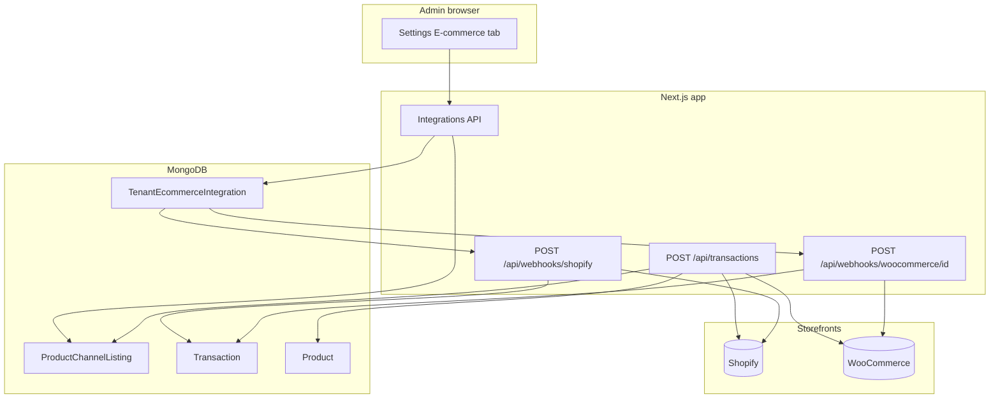

# E-commerce integrations (Shopify & WooCommerce)

This document describes how the POS connects to **Shopify** and **WooCommerce**: credential storage, catalog sync, two-way inventory behavior, order import, HTTP APIs, webhooks, and operational limits.

Secrets are **never** stored in tenant `settings` (which may be exposed to the client). They live in MongoDB only, encrypted at rest.

---

## Table of contents

1. [Overview](#overview)
2. [Architecture](#architecture)
3. [Environment variables](#environment-variables)
4. [Subscription gating](#subscription-gating)
5. [Tenant integration layer (settings)](#tenant-integration-layer-settings)
6. [Data models](#data-models)
7. [User-facing setup](#user-facing-setup)
8. [HTTP API reference](#http-api-reference)
9. [Webhooks](#webhooks)
10. [Catalog sync](#catalog-sync)
11. [Inventory behavior](#inventory-behavior)
12. [Order import](#order-import)
13. [Security](#security)
14. [Troubleshooting](#troubleshooting)
15. [Source code map](#source-code-map)

---

## Overview

| Capability | Description |
|------------|-------------|
| **Catalog** | Pull products/variants from the storefront; link to POS products by **SKU** (optional **auto-create** missing products on sync). |
| **Inventory (outbound)** | After a **POS** sale or refund that changes stock, available quantity is pushed to linked channels (Shopify inventory levels / Woo stock quantity). |
| **Inventory (inbound)** | **Paid** online orders (webhooks) decrement POS stock using a dedicated stock reason so the POS does **not** echo the same change back to the channel. |
| **Orders** | Webhooks create a completed **Transaction** (+ **Payment**) in the POS for reporting, idempotent per external order. |

**Providers:** `shopify` | `woocommerce` (at most one active integration document per provider per tenant).

---

## Architecture



**Public URL resolution** (`lib/ecommerce/public-url.ts`):

1. `NEXT_PUBLIC_APP_URL` (recommended in production), no trailing slash  
2. Else origin parsed from `SHOPIFY_OAUTH_REDIRECT_URI` (full callback URL), if set  
3. Else in **non-production**, `request.nextUrl.origin` when the handler receives a request (e.g. ngrok without duplicating env)  
4. Else `https://` + `VERCEL_URL`  
5. Else `request.nextUrl.origin` if available  
6. Else `http://localhost:3000`  

Shopify **OAuth `redirect_uri`** is `getShopifyOAuthRedirectUri(request)` (see below). Webhook `delivery_url` values use the same resolved base.

---

## Environment variables

| Variable | Required | Purpose |
|----------|----------|---------|
| `ECOMMERCE_CREDENTIALS_ENCRYPTION_KEY` | **Yes in production** | AES-256-GCM key: **64 hex characters** OR **base64** encoding exactly **32 bytes**. |
| `NEXT_PUBLIC_APP_URL` | Strongly recommended | Public origin for Shopify OAuth callback and webhook endpoints. Must match how you open the app when not using the overrides below. |
| `SHOPIFY_OAUTH_REDIRECT_URI` | Optional | Full callback URL, **exactly** as whitelisted in Shopify (e.g. `https://your-domain.com/api/integrations/shopify/oauth/callback`, no trailing slash). Overrides only the OAuth `redirect_uri`; set `NEXT_PUBLIC_APP_URL` to the **same origin** so webhooks match. |
| `VERCEL_URL` | Optional | Used when `NEXT_PUBLIC_APP_URL` is unset (Vercel deployments). |
| `SHOPIFY_CLIENT_ID` | For Shopify | Custom app Client ID from Shopify Partners. |
| `SHOPIFY_CLIENT_SECRET` | For Shopify | Same secret verifies **OAuth HMAC** on callback **and** `X-Shopify-Hmac-Sha256` on webhooks. |
| `SHOPIFY_SCOPES` | Optional | Comma-separated scopes. Default in code includes `read_locations` (required for default inventory location). Defaults: `read_products,write_products,read_inventory,write_inventory,read_orders,read_locations`. |
| `JWT_SECRET` | Dev fallback only | If `ECOMMERCE_CREDENTIALS_ENCRYPTION_KEY` is unset in non-production, a dev key is derived (not for production). |

**WooCommerce** uses per-tenant REST **consumer key/secret** entered in the UI; they are encrypted with the same `ECOMMERCE_CREDENTIALS_ENCRYPTION_KEY`.

---

## Subscription gating

- **Production:** Connect, sync, and disconnect require the tenant’s subscription feature **`customIntegrations`** (`checkFeatureAccess` via `lib/ecommerce/require-ecommerce-feature.ts`).
- **Non-production:** Feature check is skipped so local/staging testing is easier.
- **`GET /api/integrations/ecommerce/status`** returns `ecommerceFeatureUnlocked` so the UI can show whether the plan allows integration actions in production.

---

## Tenant integration layer (settings)

Each tenant chooses **which** storefront types may be used. This is stored in **tenant settings** (not secrets):

```ts
settings.integrations.ecommerce = {
  shopifyEnabled: boolean,    // default false in schema / defaults
  wooCommerceEnabled: boolean,
};
```

| Field | Meaning |
|-------|---------|
| `shopifyEnabled` | When `true`, staff may start Shopify OAuth and complete connect. |
| `wooCommerceEnabled` | When `true`, staff may POST WooCommerce REST keys to connect. |

**Enforcement:** `requireEcommerceProviderConnectAllowed` in `lib/ecommerce/tenant-integration-policy.ts` runs on:

- `GET /api/integrations/shopify/oauth/start`
- `GET /api/integrations/shopify/oauth/callback` (before token exchange)
- `POST /api/integrations/woocommerce/connect`

**UI (Settings → E-commerce):** “Store integrations” toggles persist via `PUT /api/tenants/[slug]/settings`. A toggle cannot be turned **off** while that channel is still connected (disconnect first).

Defaults: `getDefaultTenantSettings()` includes `integrations.ecommerce` with both flags `false` so new tenants opt in explicitly.

**Status API:** `GET /api/integrations/ecommerce/status` also returns `ecommercePolicy: { shopifyEnabled, wooCommerceEnabled }` for clients that do not read tenant settings separately.

---

## Data models

### `TenantEcommerceIntegration`

One document per `(tenantId, provider)`.

| Field | Description |
|-------|-------------|
| `tenantId` | Tenant ObjectId |
| `provider` | `shopify` \| `woocommerce` |
| `shopDomain` | Shopify: `store.myshopify.com` |
| `siteUrl` | Woo: base site URL, no trailing slash |
| `credentialsEncrypted` | Encrypted blob (Shopify: `{ accessToken }`; Woo: `{ consumerKey, consumerSecret }`) |
| `webhookSecretEncrypted` | Woo only: encrypted `{ secret }` used to verify `X-WC-Webhook-Signature` |
| `scopes` | Shopify granted scopes (array) |
| `shopifyLocationId` | Default Shopify location for `inventory_levels/set` |
| `defaultBranchId` | Optional branch used when reading POS stock for outbound push |
| `lastSyncAt`, `lastError` | Catalog sync telemetry |

### `ProductChannelListing`

Links a POS product (and optional **variation** dimensions) to a channel line.

| Field | Description |
|-------|-------------|
| `tenantId`, `productId`, `provider` | Scope and channel |
| `externalProductId`, `externalVariantId` | Store IDs (Woo simple products use the same id for both) |
| `inventoryItemId` | Shopify **inventory_item** id (needed for inventory push) |
| `variation` | `{ size?, color?, type? }` when stock is on a POS variation row |

Unique index: `(tenantId, provider, externalVariantId)`.

### `Transaction` (channel fields)

| Field | Description |
|-------|-------------|
| `salesChannel` | `shopify` \| `woocommerce` (imported orders) |
| `externalOrderId` | Store order id string |
| `channelSyncKey` | `${provider}:${externalOrderId}` — **sparse unique** with `tenantId` for idempotency |
| `channelImportedAt` | When the POS record was created from a webhook |

---

## User-facing setup

1. Open **Store Settings** → **E-commerce** tab (`/[tenant]/[lang]/settings?tab=ecommerce` also selects the tab on load).
2. Under **Store integrations**, turn on **Shopify** and/or **WooCommerce** (saved to tenant settings). You cannot turn a channel off while it is still connected—disconnect first.
3. **Shopify:** enter `your-store.myshopify.com` → **Connect with Shopify** → complete OAuth → redirected back to settings.
4. **WooCommerce:** enter site URL, REST consumer key and secret → **Save and connect**.
5. Run **Run catalog sync** per channel (optional **auto-create** products from sync is enabled from the UI payload).
6. Use **Disconnect** to remove the integration document and all `ProductChannelListing` rows for that provider.

The UI never displays access tokens or API secrets; status comes from `GET /api/integrations/ecommerce/status`.

---

## HTTP API reference

All authenticated routes expect a logged-in staff session and, where applicable, `?tenant=<slug>` consistent with `requireTenantAccess` (same pattern as other tenant APIs).

### `GET /api/integrations/ecommerce/status`

- **Auth:** `admin` \| `manager` \| `owner` \| `super_admin`
- **Response:** `{ success, data: [...], ecommerceFeatureUnlocked }`
- Each row: `provider`, `shopDomain` / `siteUrl`, `lastSyncAt`, `lastError`, `hasLocation` (Shopify)

### `POST /api/integrations/ecommerce/sync`

- **Auth:** same roles; **production:** requires `customIntegrations`
- **Body:** `{ "provider": "shopify" \| "woocommerce", "autoCreateProducts": true }`
- **Response:** `{ success, data: { linked, created, skipped } }`
- **Rate limit:** 10 requests / minute / tenant (approximate)

### `POST /api/integrations/ecommerce/disconnect`

- **Auth:** `admin` \| `owner` \| `super_admin`; **production:** `customIntegrations`
- **Body:** `{ "provider": "shopify" \| "woocommerce" }`
- Deletes integration + channel listings for that provider.

### `GET /api/integrations/shopify/oauth/start`

- **Query:** `shop=<myshopify domain>&tenant=<slug>&lang=en|es`
- Redirects to Shopify OAuth authorize URL.
- **Rate limit:** per user id

### `GET /api/integrations/shopify/oauth/callback`

- **Public** (Shopify redirect); validates OAuth **HMAC** on query, `state` JWT, exchanges `code` for token, upserts integration, registers webhooks, redirects to `/{slug}/{lang}/settings?tab=ecommerce&shopify=connected`.

### `POST /api/integrations/woocommerce/connect`

- **Body:** `{ siteUrl, consumerKey, consumerSecret }`
- **Site URL:** normalized with `normalizeWooCommerceSiteUrl` (adds `https://` when missing, preserves subdirectory installs, strips trailing slash). Invalid URLs return **400**.
- Validates with `GET /wc/v3/products?per_page=1`, stores encrypted credentials, registers webhooks.
- **Webhooks:** existing deliveries whose URL contains `/api/webhooks/woocommerce/<thisIntegrationId>` are removed first (avoids duplicates on reconnect), then **`order.updated`** and **`order.created`** are registered with the same signing secret. Delivery base URL uses `getPublicAppUrl(request)` when available (see public URL resolution).

---

## Webhooks

### Shopify — `POST /api/webhooks/shopify`

- **Headers:** `X-Shopify-Hmac-Sha256` (required), `X-Shopify-Topic`, `X-Shopify-Shop-Domain`
- **Body:** Raw JSON string (HMAC computed over **raw** body).
- **Secret:** `SHOPIFY_CLIENT_SECRET`
- **Shop resolution:** `TenantEcommerceIntegration` with `provider: 'shopify'` and matching `shopDomain`.
- **Registered topics:** `orders/paid`, `orders/updated` (delivery URL identical; handler processes `orders/*` when `financial_status === 'paid'`).

### WooCommerce — `POST /api/webhooks/woocommerce/[integrationId]`

- **Path:** Mongo `_id` of the `TenantEcommerceIntegration` document (`provider: woocommerce`).
- **Header:** `X-WC-Webhook-Signature` — base64(HMAC-SHA256(raw body, webhook secret)).
- **Secret:** Plain secret generated at connect time, stored encrypted in `webhookSecretEncrypted`.
- **Registered topics:** `order.updated` and `order.created` (importer only creates POS transactions for **`processing`** and **`completed`**; other statuses are ignored — idempotency prevents double-import when both webhooks fire).

---

## Catalog sync

Implemented in `lib/ecommerce/sync-catalog.ts`.

1. **Fetch** all active catalog entries from the channel (Shopify REST with pagination via `page_info`; Woo REST pages + **paginated** `/products/{id}/variations` for **all** variable products — even when the product list omits `variations[]` ids). **Grouped** and **external** Woo product types are skipped. Product images are mapped into `imageUrl` when present.
2. For each variant:
   - **Match** POS product by SKU: exact product `sku`, or `variations[].sku` when `hasVariations` is true.
   - If no match and **`autoCreateProducts`** is true, create a simple POS product (name from channel, price, stock from channel when available).
3. **Upsert** `ProductChannelListing` for `(tenantId, provider, externalVariantId)`.

After a successful sync, `lastSyncAt` is set and `lastError` cleared on the integration document.

---

## Inventory behavior

### Stock reasons (loop prevention)

| Reason | Set by | Outbound channel push |
|--------|--------|------------------------|
| `Transaction sale` | POS checkout | **Yes** — push absolute available quantity to Shopify/Woo for linked listings |
| `Transaction refund` / return flows | POS refund / void | **Yes** |
| `channel_sale` | Webhook order import | **No** — channel already sold the item |
| `channel_refund` | (reserved for future inbound refunds) | **No** |

Constants: `STOCK_REASON_CHANNEL_SALE`, `STOCK_REASON_CHANNEL_REFUND` in `lib/ecommerce/constants.ts`.

### Outbound push (`lib/ecommerce/inventory-push.ts`)

- After successful **POST `/api/transactions`** (line items with `productId`), product ids are pushed asynchronously.
- After **refund** routes that call `updateStock` to restock, linked products are pushed.
- **Shopify:** requires `shopifyLocationId` + listing `inventoryItemId`; uses Admin REST `inventory_levels/set`.
- **Woo:** updates product or variation `stock_quantity` to match **current POS available** (`getProductStock`), honoring `defaultBranchId` on the integration when set.

### Multi-branch (v1)

Optional `defaultBranchId` on `TenantEcommerceIntegration` steers which branch stock is read for outbound quantity. Fine-grained per-location ↔ fulfillment mapping is not implemented.

---

## Order import

Implemented in `lib/ecommerce/import-channel-order.ts`.

### Eligibility

| Channel | Imported when |
|---------|----------------|
| **Shopify** | `financial_status === 'paid'`; line items must have `product_id` and `variant_id`. |
| **WooCommerce** | Order `status` is `processing` or `completed`. Line unit price prefers `line_item.price`; if zero, falls back to `subtotal` or `total` divided by quantity (discount-heavy lines). |

### Steps (atomic Mongo transaction)

1. Skip if `Transaction` already exists with same `channelSyncKey`.
2. Resolve each line to `ProductChannelListing` by `externalVariantId`.
3. If **no** lines resolve, abort (`no_mapped_line_items`).
4. `updateStock(..., 'sale', { reason: 'channel_sale', notes: 'channelSyncKey:...' })` per line.
5. Create **Transaction** (`paymentMethod: 'digital'`, `paymentProvider` = provider, `paymentReference` = external order id) + **Payment**.
6. Link recent **StockMovement** rows with matching `notes` to the new transaction id.

### Idempotency

- **Unique:** `(tenantId, channelSyncKey)` sparse index on `Transaction`.
- Duplicate webhooks return success without double-counting stock.

---

## Security

- **Encryption:** AES-256-GCM (`lib/ecommerce/crypto.ts`); rotate by re-encrypting credentials (disconnect + reconnect) if the key is rotated.
- **Shopify OAuth callback:** HMAC over sorted query params (excluding `hmac` / `signature`) using `SHOPIFY_CLIENT_SECRET`.
- **OAuth `state`:** short-lived JWT (`lib/ecommerce/shopify-oauth-state.ts`) binding tenant + slug + lang.
- **Webhooks:** reject invalid HMAC/signature with **401**.
- **Do not** put tokens in `tenant.settings` or expose them from `GET /api/tenants/[slug]/settings`.

---

## Troubleshooting

| Symptom | Things to check |
|---------|-------------------|
| Shopify `redirect_uri is not whitelisted` | In Shopify Partners → your app → **App URL** / **Allowed redirection URL(s)**, add the **exact** URL the server sends: same scheme (`https` except localhost), host, and path `/api/integrations/shopify/oauth/callback` (no trailing slash). It must match `NEXT_PUBLIC_APP_URL` + that path, or your full `SHOPIFY_OAUTH_REDIRECT_URI` if set. If you browse via ngrok, set `NEXT_PUBLIC_APP_URL` to that `https://…ngrok…` origin or rely on dev request-origin resolution (when `NEXT_PUBLIC_APP_URL` is unset). |
| Shopify connect fails (other) | `SHOPIFY_CLIENT_ID` / `SECRET`, HTTPS in production. |
| Webhooks 401 | Shopify: secret mismatch (app secret vs header). Woo: URL must match registered `delivery_url`; integration id in path must match DB row. |
| Catalog sync errors | `lastError` on integration; Woo REST keys and **HTTPS** site; Shopify token scopes include read products/inventory. |
| Stock not pushing to Shopify | `shopifyLocationId` missing (no active location); listing missing `inventoryItemId` (run sync after fixing catalog). |
| Orders not importing | No `ProductChannelListing` for variant ids — run **catalog sync** with correct SKUs or auto-create. Shopify order not **paid**. Woo status not `processing`/`completed`. |
| Production “feature not available” | Subscription plan must include **`customIntegrations`**. |

---

## Source code map

| Area | Path |
|------|------|
| Constants / API version | `lib/ecommerce/constants.ts` |
| Credential crypto | `lib/ecommerce/crypto.ts` |
| Credential getters | `lib/ecommerce/integration-credentials.ts` |
| Public base URL | `lib/ecommerce/public-url.ts` |
| Subscription gate | `lib/ecommerce/require-ecommerce-feature.ts` |
| Tenant settings policy | `lib/ecommerce/tenant-integration-policy.ts` |
| Catalog sync | `lib/ecommerce/sync-catalog.ts` |
| Shopify REST / OAuth | `lib/ecommerce/shopify-api.ts`, `shopify-oauth.ts`, `shopify-oauth-state.ts`, `shopify-catalog.ts` |
| Woo REST | `lib/ecommerce/woocommerce-api.ts`, `woocommerce-catalog.ts` |
| Webhook verification | `lib/ecommerce/webhook-verify.ts` |
| Webhook dispatch | `lib/ecommerce/process-channel-webhook.ts` |
| Order import | `lib/ecommerce/import-channel-order.ts`, `parse-shopify-order.ts`, `parse-woo-order.ts` |
| Inventory push | `lib/ecommerce/inventory-push.ts` |
| Webhook registration | `lib/ecommerce/register-shopify-webhooks.ts`, `register-woo-webhooks.ts` |
| Models | `models/TenantEcommerceIntegration.ts`, `models/ProductChannelListing.ts`, `models/Transaction.ts` |
| APIs | `app/api/integrations/**`, `app/api/webhooks/**` |
| POS stock hooks | `app/api/transactions/route.ts`, `app/api/transactions/[id]/refund/route.ts`, `app/api/transactions/[id]/route.ts` |
| Settings UI | `components/settings/EcommerceIntegrationsSettings.tsx`, `app/[tenant]/[lang]/settings/page.tsx` |
| Tests | `__tests__/ecommerce.test.ts` |

---

## Version notes

- Shopify Admin API version used in requests: **`2024-07`** (`SHOPIFY_API_VERSION` in `lib/ecommerce/constants.ts`).
- Behavior may evolve; when in doubt, refer to the implementation files listed above.
