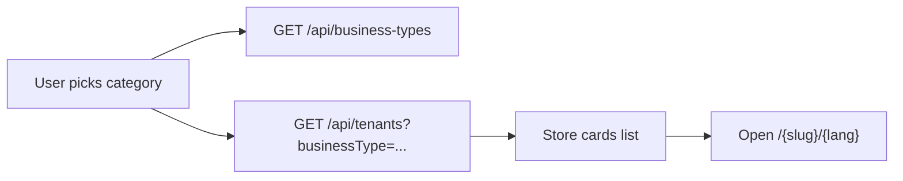

# Mobile app: store directory & business-type selection

This document describes how a **consumer-facing mobile app** can integrate with this platform so end users can **choose what kind of business they want** (for example food vs laundry), then **see matching partner stores (tenants)** and open the correct storefront.

It complements the staff-focused [Tenant API Reference](./tenant-manual/14-api-reference.md), which assumes authenticated POS users. The directory flows below use **public, unauthenticated** endpoints where appropriate.

---

## Concepts

| Term | Meaning |
|------|--------|
| **Tenant** | One business account on the platform. In a marketplace-style app, each tenant is usually one **partner store** (or brand) the customer can order from or book with. |
| **Business type** | A **category** configured for the tenant (for example `restaurant`, `laundry`). It drives POS features and is the right field to use when the user picks “Food” vs “Laundry”. |
| **Slug** | Short URL-safe identifier for the tenant (for example `acme-cafe`). Used in deep links into the web app or future native routes. |

Business types are defined in code (`retail`, `restaurant`, `laundry`, `service`, `general`) with human-readable names and descriptions exposed by the API.

---

## Target user experience

1. **Choose intent** — User selects a high-level intent: “Order food”, “Book laundry”, “Retail”, etc. Map each option to a **business type** `type` value from the API (see below).
2. **List stores** — Show only tenants whose `settings.businessType` matches that type (and are active).
3. **Open a store** — User taps a store; the app opens that tenant’s experience (typically the existing **web storefront** at `/{tenantSlug}/{lang}`, or a WebView, until native checkout exists).

Optional: **Search** by name, slug, or city on the client using the fields returned by the tenant list.



---

## APIs

### 1. List business types (category picker)

Use this to build the first screen: labels, descriptions, and which `type` string to pass into the tenant list.

```http
GET /api/business-types
```

**Response (simplified):**

```json
{
  "success": true,
  "data": [
    {
      "type": "restaurant",
      "name": "Restaurant / Food Service",
      "description": "Restaurant, cafe, or food service establishment",
      "defaultFeatures": { "...": "..." },
      "productTypes": ["regular", "bundle", "service"]
    },
    {
      "type": "laundry",
      "name": "Laundry Service",
      "description": "Laundry, dry cleaning, or garment care service",
      "defaultFeatures": { "...": "..." },
      "productTypes": ["service"]
    }
  ]
}
```

**Single type:**

```http
GET /api/business-types?type=restaurant
```

Returns the full config object for that type.

**Mobile mapping tips:**

- Use `type` for filtering tenants (`restaurant`, `laundry`, …).
- Use `name` / `description` for UI copy; localize in the app if needed.

---

### 2. List tenants (stores) for the directory

Public listing for **active** tenants. No `Authorization` header required.

```http
GET {BASE_URL}/api/tenants
```

**Optional query parameter:**

| Parameter | Description |
|-----------|-------------|
| `businessType` | If set, only tenants whose `settings.businessType` matches this value **case-insensitively** (for example `restaurant` or `Laundry`). Omit to return all active tenants. |

Examples:

```http
GET /api/tenants
GET /api/tenants?businessType=restaurant
GET /api/tenants?businessType=laundry
```

**Response shape (public, unauthenticated):**

Each item includes only fields intended for a public directory:

| Field | Purpose |
|-------|--------|
| `slug` | Deep link segment; unique handle. |
| `name` | Internal / fallback display name. |
| `settings.companyName` | Preferred display name when set. |
| `settings.logo` | Logo URL for list cells (resolve relative URLs against `BASE_URL` if needed). |
| `settings.currency` / `settings.language` | Defaults for pricing and locale when entering the store. |
| `settings.businessType` | Category for badges and client-side filtering (lowercase in normal flows). |
| `settings.address.city` / `settings.address.country` | Optional subtitle on cards when configured. |

```json
{
  "success": true,
  "data": [
    {
      "slug": "demo-cafe",
      "name": "Demo Cafe",
      "settings": {
        "companyName": "Demo Cafe",
        "logo": "/uploads/...",
        "currency": "PHP",
        "language": "en",
        "businessType": "restaurant",
        "address": { "city": "Manila", "country": "PH" }
      }
    }
  ]
}
```

**Admin-authenticated callers:** If the request is authorized as a platform **admin**, `GET /api/tenants` returns a **richer** tenant document (`settings` in full). Mobile consumer apps should not depend on that; use the public shape above.

---

## Deep linking into a tenant

After the user selects a store, send them to the tenant’s web app entry:

```text
https://{your-host}/{tenantSlug}/{lang}
```

Examples:

- `https://example.com/demo-cafe/en`
- `https://example.com/demo-cafe/es`

Use `settings.language` as a hint for default `lang` (`en` or `es`); allow the user to override via your app’s language settings.

In a native shell, this is typically implemented with an **in-app browser** or **WebView** until dedicated native APIs exist for catalog and checkout.

---

## Suggested client implementation

1. On first launch (or from cache), call `GET /api/business-types` and cache `data` for 24 hours.
2. When the user picks a category, call `GET /api/tenants?businessType={type}` with the exact `type` from step 1 (`restaurant`, `laundry`, etc.).
3. Render cards: primary line `companyName || name`, secondary line city/country if present, logo if present.
4. On tap, navigate to `/{slug}/{preferredLang}`.

**Search:** Filter the returned array locally by `slug`, `name`, and `settings.companyName` (and city if shown). Server-side text search is not part of the minimal contract today; add a dedicated endpoint later if lists grow large.

**Pagination:** The public `GET /api/tenants` response is unpaginated. If you expect many tenants, coordinate a paginated or search API extension with the backend team.

---

## Security and privacy

- The public tenant list is **read-only** and **scoped** to non-sensitive directory fields. Full address, tax IDs, and admin data are not exposed on the anonymous route.
- **Do not** embed admin or tenant staff tokens in a consumer app for this flow.
- Any **ordering, payments, or account-specific** actions happen **inside** the tenant context and follow that tenant’s own auth and APIs (see tenant manual).

---

## Alignment with the web “Stores” page

The marketing **Stores** directory on the web (`/stores`) uses the same `GET /api/tenants` contract. Mobile and web stay aligned if they use the same `businessType` filter and display fields.

---

## Related code (for maintainers)

- Business type definitions: `lib/business-types.ts`
- Public business types API: `app/api/business-types/route.ts`
- Tenant listing and optional filter: `app/api/tenants/route.ts` (`GET`)

---

## Revision history

| Date | Notes |
|------|--------|
| 2026-04-24 | Initial document; public tenants API includes `businessType`, optional location fields, and `?businessType=` filter for mobile and web directory use. |
